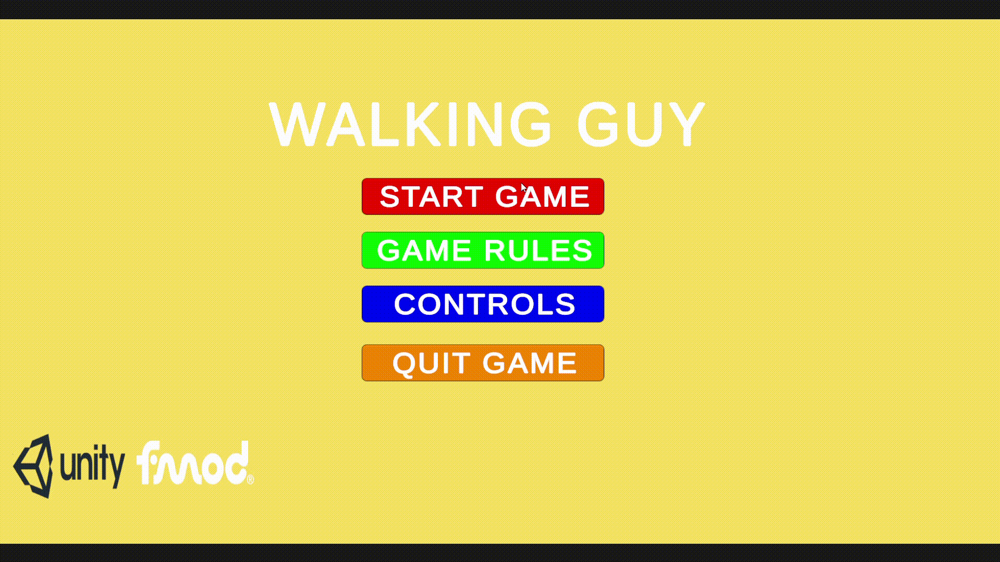

# **THE WALKING GUY**

Gioco realizzato interamente con Unity per la parte Grafica e Logica e FMOD per la parte Audio Interattiva

**Tecnologie Utilizzate** -> Unity, FMOD, C#, Cubase

Il gioco si presenta con un'inquadratura dall'alto che mostra 6 stanze di colore diverso e un Player che è possibile muovere all'interno dell'area di gioco.

Per ogni stanza e per le piattaforme nere che collegano i vari ambienti sono state create musiche dedicate che è possibile sentire recandosi nei diversi luoghi, è stato implementato anche il Sound Design riguardo al suono dei passi, del salto e dell'affanno del Player, del suono vento fisso nell'area di gioco e nel Menù e del suono della presa dei vari cubi collezionabili.

All'interno del gioco è possibile visionare le regole per la vittoria e i controlli necessari per gestire il Player.

**Breve dimostrazione del gioco**

