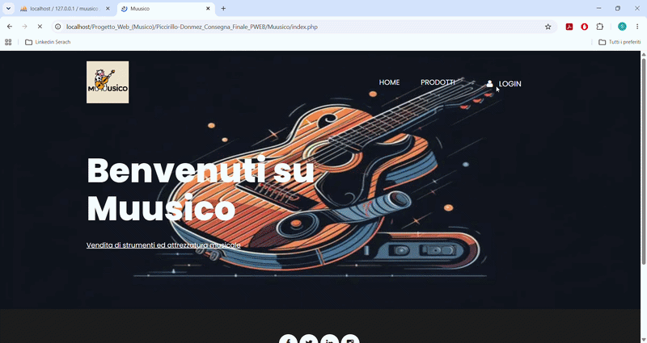

# **MUUSICO**

Breve video di dimostrazione/Short demonstration video

Video esteso/Extended Video

https://github.com/SimPicc/Portfolio/tree/main/Muusico%20(Web%20Site)%20-%20Esame%20Programmazione%20Per%20Il%20Web/Registrazione%20Sito%20In%20Funzione

**---ITALIANO---**

Sito Web creato per esame universitario

**Tecnologie utilizzate**: Html, Css, Php, Sql, Xamp, Bootstrap, Javascript

Nome del sito: Muusico

Tipologia: Compravendita di strumenti musicali

3 tipologie di utenti:

-**Compratore** -> Può visionare i prodotti, leggere le recensioni fatte da utenti che hanno acquistato quel prodotto, comprare prodotti aggiungendoli nel proprio carrello, scrivere recensioni su prodotti acquistati, visionare gli ordini fatti in precedenza

-**Venditore** -> Può aggiungere prodotti da vendere, gestire le quantità dei prodotti in magazzino, modificare gli annunci dei prodotti

-**Amministratore** -> Autorizza l'iscrizione al sito da parte degli utenti, può bloccare/sbloccare utenit, eliminare recensioni, eleminare prodotti 

Nel file **funzioni.php**(https://github.com/SimPicc/Portfolio/blob/main/Muusico%20(Web%20Site)%20-%20Esame%20Programmazione%20Per%20Il%20Web/funzioni.php) sono presenti le query più importanti per il corretto funzionamento del sito, riguardo l'aggiunta, l'eliminazione o la modifica di prodotti e recensioni, il filtraggio sulla ricerca di un determinato prodotto ecc...

Progetto elaborato in coppia

**---ENGLISH---**

Website created for a university exam

**Technologies used**: HTML, CSS, PHP, SQL, XAMPP, Bootstrap, JavaScript

Site name: Muusico

Type: Musical instrument marketplace

3 user types:

-**Buyer** -> Can view products, read reviews from users who purchased a specific product, buy products by adding them to the cart, write reviews for purchased products, and view past orders

-**Seller** -> Can add products for sale, manage stock quantities, and edit product listings

-**Administrator** -> Approves user registrations, can block/unblock users, and delete reviews or products

The **funzioni.php** file (https://github.com/SimPicc/Portfolio/blob/main/Muusico%20(Web%20Site)%20-%20Esame%20Programmazione%20Per%20Il%20Web/funzioni.php) contains the key queries required for the site's proper functioning—handling the addition, deletion, or modification of products and reviews, product search filtering, etc.

Project developed as a two-person team
